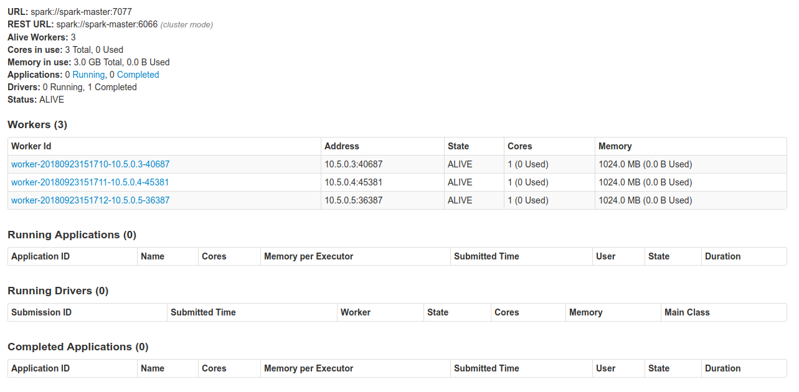
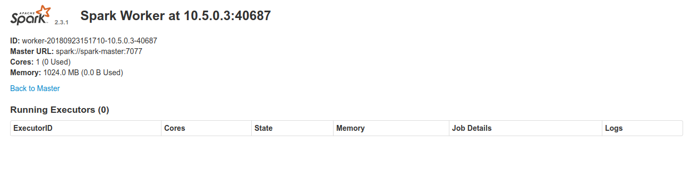
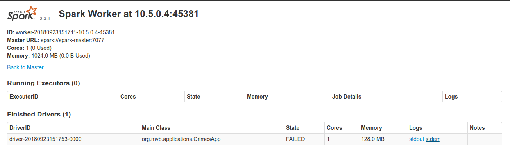
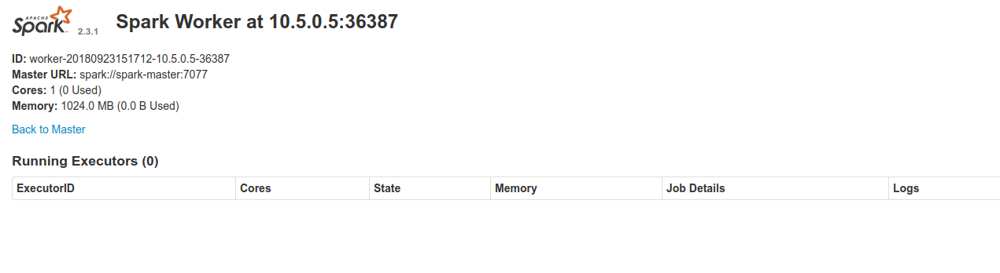

# Spark Cluster with Docker & docker-compose

# General

A simple spark standalone cluster for your testing environment purposses. A *docker-compose up* away from you solution for your spark development environment.

The Docker compose will create the following containers:

container|Ip address
---|---
spark-master|10.5.0.2
spark-worker-1|10.5.0.3
spark-worker-2|10.5.0.4
spark-worker-3|10.5.0.5

# Installation

The following steps will make you run your spark cluster's containers.

## Pre requisites

* Docker installed

* Docker compose  installed

* A spark Application Jar to play with(Optional)

## Build the images

The first step to deploy the cluster will be the build of the custom images, these builds can be performed with the *build-images.sh* script. 

The executions is as simple as the following steps:

```sh
chmod +x build-images.sh
./build-images.sh
```

This will create the following docker images:

* spark-base:2.3.1: A base image based on java:alpine-jdk-8 wich ships scala, python3 and spark 2.3.1

* spark-master:2.3.1: A image based on the previously created spark image, used to create a spark master containers.

* spark-worker:2.3.1: A image based on the previously created spark image, used to create spark worker containers.

* spark-submit:2.3.1: A image based on the previously created spark image, used to create spark submit containers(run, deliver driver and die gracefully).

## Run the docker-compose

The final step to create your test cluster will be to run the compose file:

```sh
docker-compose up --scale spark-worker=3
```

## Validate your cluster

Just validate your cluster accesing the spark UI on each worker & master URL.

### Spark Master

http://10.5.0.2:8080/



### Spark Worker 1

http://10.5.0.3:8081/



### Spark Worker 2

http://10.5.0.4:8081/



### Spark Worker 3

http://10.5.0.5:8081/



# Resource Allocation 

This cluster is shipped with three workers and one spark master, each of these has a particular set of resource allocation(basically RAM & cpu cores allocation).

* The default CPU cores allocation for each spark worker is 1 core.

* The default RAM for each spark-worker is 1024 MB.

* The default RAM allocation for spark executors is 256mb.

* The default RAM allocation for spark driver is 128mb

* If you wish to modify this allocations just edit the env/spark-worker.sh file.

# Binded Volumes

To make app running easier I've shipped two volume mounts described in the following chart:

Host Mount|Container Mount|Purposse
---|---|---
/mnt/spark-apps|/opt/spark-apps|Used to make available your app's jars on all workers & master
/mnt/spark-data|/opt/spark-data| Used to make available your app's data on all workers & master

This is basically a dummy DFS created from docker Volumes...(maybe not...)

# Run a sample application

Now let`s make a **wild spark submit** to validate the distributed nature of our new toy following these steps:

## Create a Scala spark app

The first thing you need to do is to make a spark application. Our spark-submit image is designed to run scala code (soon will ship pyspark support guess I was just lazy to do so..).

In my case I am using an app called  [crimes-app](https://). You can make or use your own scala app, I 've just used this one because I had it at hand.


## Ship your jar & dependencies on the Workers and Master

A necesary step to make a **spark-submit** is to copy your application bundle into all workers, also any configuration file or input file you need.

Luckily for us we are using docker volumes so, you just have to copy your app and configs into /mnt/spark-apps, and your input files into /mnt/spark-files.

```bash
#Copy spark application into all workers's app folder
cp /home/workspace/crimes-app/build/libs/crimes-app.jar /mnt/spark-apps

#Copy spark application configs into all workers's app folder
cp -r /home/workspace/crimes-app/config /mnt/spark-apps

# Copy the file to be processed to all workers's data folder
cp /home/Crimes_-_2001_to_present.csv /mnt/spark-files
```

## Check the successful copy of the data and app jar (Optional)

This is not a necessary step, just if you are curious you can check if your app code and files are in place before running the spark-submit.

```sh
# Worker 1 Validations
docker exec -ti spark-worker-1 ls -l /opt/spark-apps

docker exec -ti spark-worker-1 ls -l /opt/spark-data

# Worker 2 Validations
docker exec -ti spark-worker-2 ls -l /opt/spark-apps

docker exec -ti spark-worker-2 ls -l /opt/spark-data

# Worker 3 Validations
docker exec -ti spark-worker-3 ls -l /opt/spark-apps

docker exec -ti spark-worker-3 ls -l /opt/spark-data
```
After running one of this commands you have to see your app's jar and files.


## Use docker spark-submit

```bash
#Creating some variables to make the docker run command more readable
#App jar environment used by the spark-submit image
SPARK_APPLICATION_JAR_LOCATION="/opt/spark-apps/crimes-app.jar"
#App main class environment used by the spark-submit image
SPARK_APPLICATION_MAIN_CLASS="org.mvb.applications.CrimesApp"
#Extra submit args used by the spark-submit image
SPARK_SUBMIT_ARGS="--conf spark.executor.extraJavaOptions='-Dconfig-path=/opt/spark-apps/dev/config.conf'"

#We have to use the same network as the spark cluster(internally the image resolves spark master as spark://spark-master:7077)
docker run --network docker-spark-cluster_spark-network \
-v /mnt/spark-apps:/opt/spark-apps \
--env SPARK_APPLICATION_JAR_LOCATION=$SPARK_APPLICATION_JAR_LOCATION \
--env SPARK_APPLICATION_MAIN_CLASS=$SPARK_APPLICATION_MAIN_CLASS \
spark-submit:2.3.1

```

After running this you will see an output pretty much like this:

```bash
Running Spark using the REST application submission protocol.
2018-09-23 15:17:52 INFO  RestSubmissionClient:54 - Submitting a request to launch an application in spark://spark-master:6066.
2018-09-23 15:17:53 INFO  RestSubmissionClient:54 - Submission successfully created as driver-20180923151753-0000. Polling submission state...
2018-09-23 15:17:53 INFO  RestSubmissionClient:54 - Submitting a request for the status of submission driver-20180923151753-0000 in spark://spark-master:6066.
2018-09-23 15:17:53 INFO  RestSubmissionClient:54 - State of driver driver-20180923151753-0000 is now RUNNING.
2018-09-23 15:17:53 INFO  RestSubmissionClient:54 - Driver is running on worker worker-20180923151711-10.5.0.4-45381 at 10.5.0.4:45381.
2018-09-23 15:17:53 INFO  RestSubmissionClient:54 - Server responded with CreateSubmissionResponse:
{
  "action" : "CreateSubmissionResponse",
  "message" : "Driver successfully submitted as driver-20180923151753-0000",
  "serverSparkVersion" : "2.3.1",
  "submissionId" : "driver-20180923151753-0000",
  "success" : true
}
```

# Summary (What have I done :O?)

* We compiled the necessary docker images to run spark master and worker containers.

* We created a spark standalone cluster using 3 worker nodes and 1 master node using docker && docker-compose.

* Copied the resources necessary to run a sample application.

* Submitted an application to the cluster using a **spark-submit** docker image.

* We ran a distributed application at home(just need enough cpu cores and RAM to do so).

# Why a standalone cluster?

* This is intended to be used for test purposses, basically a way of running distributed spark apps on your laptop or desktop.

* Right now I don't have enough resources to make a Yarn, Mesos or Kubernetes based cluster :(.

* This will be useful to use CI/CD pipelines for your spark apps(A really difficult and hot topic)
