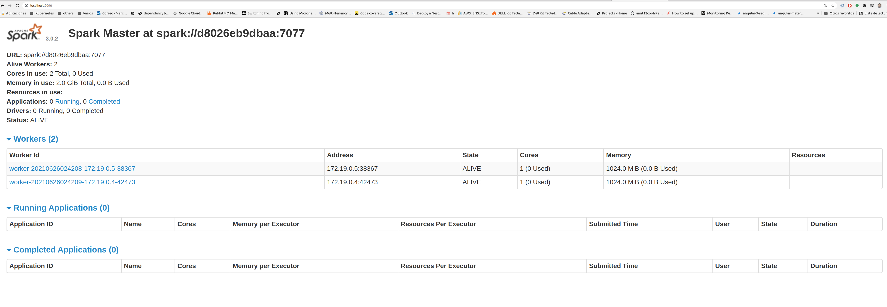
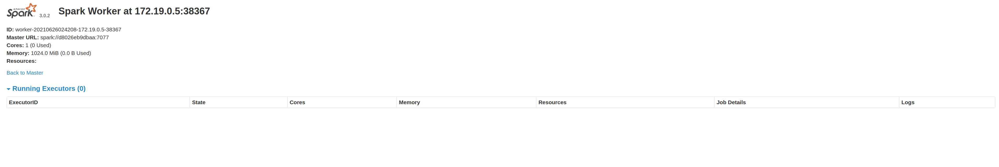
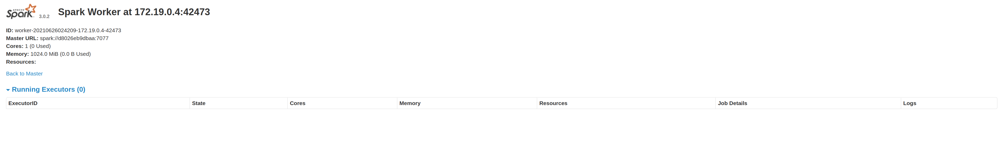
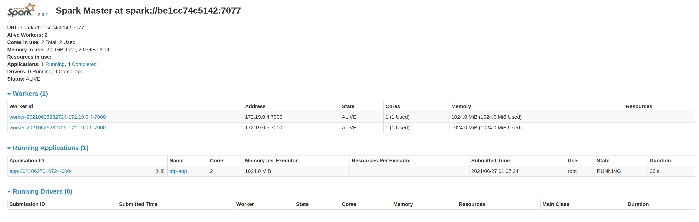
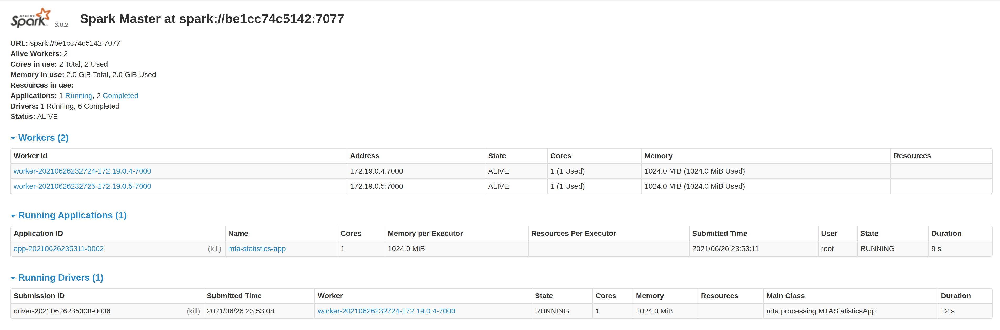

# Creating a Spark Standalone Cluster with Docker and docker-compose(2021 update)

Back in 2018 I wrote [this article](https://medium.com/@marcovillarreal_40011/creating-a-spark-standalone-cluster-with-docker-and-docker-compose-ba9d743a157f) on how to create a spark cluster with  docker and docker-compose, ever since then my humble repo got 270+ stars, a lot of forks and activity from the community, however I abandoned the project by some time(Was kinda busy with a new job on 2019 and some more stuff to take care of), I've merged some pull quest once in a while, but never put many attention on upgrading versions. 

But today we are going to revisit this old fella with some updates and hopefully run some examples with scala and python(yeah 2018 version didn't support python, thanks to the community to bring pyspark to this baby).

# Requirements

* Docker(I am using version 20.10.7)
* docker-compose(I am using version 1.21.2)
* [This repo ;)](https://github.com/mvillarrealb/docker-spark-cluster)

# Project Structure

The following project structure will be used

```sh
|
|--|apps # Apps directory for volume mounts(any app you want to deploy just paste it here)
|--|data # Data directory for volume mounts(any file you want to process just paste it here)
|--|Dockerfile #Dockerfile used to build spark image
|--|start-spark.sh # startup script used to run different spark workloads
|--|docker-compose.yml # the compose file

```

# Creating The Image

In the 2018 version, we've used a base image and a separated image for each spark workload(one image for the master one for the worker and one for spark-submit). In this new approach we will use docker multi stage builds to create a unique image that can be launched as any workload we want.

Here's the dockerfile used to define our apache-spark image:

```dockerfile

# builder step used to download and configure spark environment
FROM openjdk:11.0.11-jre-slim-buster as builder

# Add Dependencies for PySpark
RUN apt-get update && apt-get install -y curl vim wget software-properties-common ssh net-tools ca-certificates python3 python3-pip python3-numpy python3-matplotlib python3-scipy python3-pandas python3-simpy

RUN update-alternatives --install "/usr/bin/python" "python" "$(which python3)" 1

# Fix the value of PYTHONHASHSEED
# Note: this is needed when you use Python 3.3 or greater
ENV SPARK_VERSION=3.0.2 \
HADOOP_VERSION=3.2 \
SPARK_HOME=/opt/spark \
PYTHONHASHSEED=1

# Download and uncompress spark from the apache archive
RUN wget --no-verbose -O apache-spark.tgz "https://archive.apache.org/dist/spark/spark-${SPARK_VERSION}/spark-${SPARK_VERSION}-bin-hadoop${HADOOP_VERSION}.tgz" \
&& mkdir -p /opt/spark \
&& tar -xf apache-spark.tgz -C /opt/spark --strip-components=1 \
&& rm apache-spark.tgz


# Apache spark environment
FROM builder as apache-spark

WORKDIR /opt/spark

ENV SPARK_MASTER_PORT=7077 \
SPARK_MASTER_WEBUI_PORT=8080 \
SPARK_LOG_DIR=/opt/spark/logs \
SPARK_MASTER_LOG=/opt/spark/logs/spark-master.out \
SPARK_WORKER_LOG=/opt/spark/logs/spark-worker.out \
SPARK_WORKER_WEBUI_PORT=8080 \
SPARK_MASTER="spark://spark-master:7077" \
SPARK_WORKLOAD="master"

EXPOSE 8080 7077 6066

RUN mkdir -p $SPARK_LOG_DIR && \
touch $SPARK_MASTER_LOG && \
touch $SPARK_WORKER_LOG && \
ln -sf /dev/stdout $SPARK_MASTER_LOG && \
ln -sf /dev/stdout $SPARK_WORKER_LOG

COPY start-spark.sh /

CMD ["/bin/bash", "/start-spark.sh"]
```

Notice that in the dockerfile we reference a script called **start-spark.sh**, it's primary goal is to run spark-class script with the given role (master, or worker).

```sh
#start-spark.sh
#!/bin/bash
. "/opt/spark/bin/load-spark-env.sh"
# When the spark work_load is master run class org.apache.spark.deploy.master.Master
if [ "$SPARK_WORKLOAD" == "master" ];
then

export SPARK_MASTER_HOST=`hostname`

cd /opt/spark/bin && ./spark-class org.apache.spark.deploy.master.Master --ip $SPARK_MASTER_HOST --port $SPARK_MASTER_PORT --webui-port $SPARK_MASTER_WEBUI_PORT >> $SPARK_MASTER_LOG

elif [ "$SPARK_WORKLOAD" == "worker" ];
then
# When the spark work_load is worker run class org.apache.spark.deploy.master.Worker
cd /opt/spark/bin && ./spark-class org.apache.spark.deploy.worker.Worker --webui-port $SPARK_WORKER_WEBUI_PORT $SPARK_MASTER >> $SPARK_WORKER_LOG

elif [ "$SPARK_WORKLOAD" == "submit" ];
then
    echo "SPARK SUBMIT"
else
    echo "Undefined Workload Type $SPARK_WORKLOAD, must specify: master, worker, submit"
fi
```

To build the image just run:

```sh
docker build -t cluster-apache-spark:3.0.2 .
```

After some time the image will be successfully created, it will take some time depending on how fast the dependencies and the spark tarball are dowloaded (fortunatelly these steps get cached as a layer thanks to the multistage setup).


# The compose File

Now that we have our apache-spark image is time to create a cluster in docker-compose

```yaml
version: "3.3"
services:
  spark-master:
    image: cluster-apache-spark:3.0.2
    ports:
      - "9090:8080"
      - "7077:7077"
    volumes:
       - ./apps:/opt/spark-apps
       - ./data:/opt/spark-data
    environment:
      - SPARK_LOCAL_IP=spark-master
      - SPARK_WORKLOAD=master
  spark-worker-a:
    image: cluster-apache-spark:3.0.2
    ports:
      - "9091:8080"
      - "7000:7000"
    depends_on:
      - spark-master
    environment:
      - SPARK_MASTER=spark://spark-master:7077
      - SPARK_WORKER_CORES=1
      - SPARK_WORKER_MEMORY=1G
      - SPARK_DRIVER_MEMORY=1G
      - SPARK_EXECUTOR_MEMORY=1G
      - SPARK_WORKLOAD=worker
      - SPARK_LOCAL_IP=spark-worker-a
    volumes:
       - ./apps:/opt/spark-apps
       - ./data:/opt/spark-data
  spark-worker-b:
    image: cluster-apache-spark:3.0.2
    ports:
      - "9092:8080"
      - "7001:7000"
    depends_on:
      - spark-master
    environment:
      - SPARK_MASTER=spark://spark-master:7077
      - SPARK_WORKER_CORES=1
      - SPARK_WORKER_MEMORY=1G
      - SPARK_DRIVER_MEMORY=1G
      - SPARK_EXECUTOR_MEMORY=1G
      - SPARK_WORKLOAD=worker
      - SPARK_LOCAL_IP=spark-worker-b
    volumes:
        - ./apps:/opt/spark-apps
        - ./data:/opt/spark-data
  demo-database:
    image: postgres:11.7-alpine
    ports: 
      - "5432:5432"
    environment: 
      - POSTGRES_PASSWORD=casa1234
```

For both spark master and worker we configured the following environment variables:

Environment|Description
---|---
SPARK_MASTER|Spark master url
SPARK_WORKER_CORES|Number of cpu cores allocated for the worker
SPARK_WORKER_MEMORY|Amount of ram allocated for the worker
SPARK_DRIVER_MEMORY|Amount of ram allocated for the driver programs
SPARK_EXECUTOR_MEMORY|Amount of ram allocated for the executor programs
SPARK_WORKLOAD|The spark workload to run(can be any of **master**, **worker**, **submit**)


Compared to 2018 version the following changes were made:

* Removed the custom network and ip addresses

* Expose 2 workers instead of 3, and expose each worker port in the range of(9090...9091 and so on)

* Pyspark support thanks to community contributions

* Include a postgresql instance to run the demos(both demos store data in jdbc)


The final step to create your test cluster will be to run the compose file: 

```sh
docker-compose up -d
```

To validate your cluster just access the spark UI on each worker & master URL

Spark Master: http://localhost:9090



Spark Worker 1: http://localhost:9091



Spark Worker 2: http://localhost:9092



Database Server

To check database server just use the psql command(or any database client of your choice):

```sh
psql -U postgres -h 0.0.0.0 -p 5432
#It will ask for your password defined in the compose file
```

# The Demo Apps

The following apps can be found in apps directory, this apps are used as proof of concept of our cluster behavior.

## NY Bus Stops Data [Pyspark]

This programs just loads archived data from [MTA Bus Time](http://web.mta.info/developers/MTA-Bus-Time-historical-data.html) and apply basic filters using spark sql, the result are persisted into a postgresql table.

The loaded table will contain the following structure:

latitude|longitude|time_received|vehicle_id|distance_along_trip|inferred_direction_id|inferred_phase|inferred_route_id|inferred_trip_id|next_scheduled_stop_distance|next_scheduled_stop_id|report_hour|report_date
---|---|---|---|---|---|---|---|---|---|---|---|---
40.668602|-73.986697|2014-08-01 04:00:01|469|4135.34710710144|1|IN_PROGRESS|MTA NYCT_B63|MTA NYCT_JG_C4-Weekday-141500_B63_123|2.63183804205619|MTA_305423|2014-08-01 04:00:00|2014-08-01

To submit the app connect to one of the workers or the master and execute:

```sh
/opt/spark/bin/spark-submit --master spark://spark-master:7077 \
--jars /opt/spark-apps/postgresql-42.2.22.jar \
--driver-memory 1G \
--executor-memory 1G \
/opt/spark-apps/main.py
```



## MTA Bus Analytics[Scala]

This program takes the archived data from [MTA Bus Time](http://web.mta.info/developers/MTA-Bus-Time-historical-data.html) and make some aggregations on it, the calculated results are persisted on postgresql tables.

Each persisted table correspond to a particullar aggregation:

Table|Aggregation
---|---
day_summary|A summary of vehicles reporting, stops visited, average speed and distance traveled(all vehicles)
speed_excesses|Speed excesses calculated in a 5 minute window
average_speed|Average speed by vehicle
distance_traveled|Total Distance traveled by vehicle


To submit the app connect to one of the workers or the master and execute:

```sh
/opt/spark/bin/spark-submit --deploy-mode cluster \
--master spark://spark-master:7077 \
--total-executor-cores 1 \
--class mta.processing.MTAStatisticsApp \
--driver-memory 1G \
--executor-memory 1G \
--jars /opt/spark-apps/postgresql-42.2.22.jar \
--conf spark.driver.extraJavaOptions='-Dconfig-path=/opt/spark-apps/mta.conf' \
--conf spark.executor.extraJavaOptions='-Dconfig-path=/opt/spark-apps/mta.conf' \
/opt/spark-apps/mta-processing.jar
```

You will notice on the spark-ui a driver program and executor program running(In scala we can use deploy-mode cluster)



# Conclusions

* We've created a simpler version of a spark cluster in docker-compose, the main goal of this cluster is to provide you with a local environment to test the distributed nature of your spark apps without making any deploy to a production cluster.

* The generated image isn't designed/optimized to have a small footprint

* This cluster is only necessary when you want to run a spark app in a distributed environment in your machine(Production use is discouraged, use databricks or kuberetes setup instead).

# What's left to do?

* Right now to run applications in deploy-mode cluster is necessary to specify arbitrary driver port through **spark.driver.port** configuration (I must fix some networking and port issues).

* The spark submit entry in the start-spark.sh is unimplemented, the submit used in the demos can be triggered from any worker.